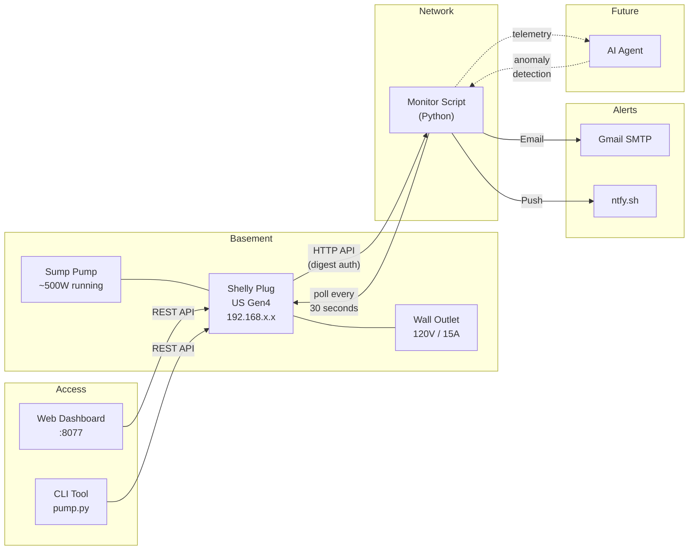
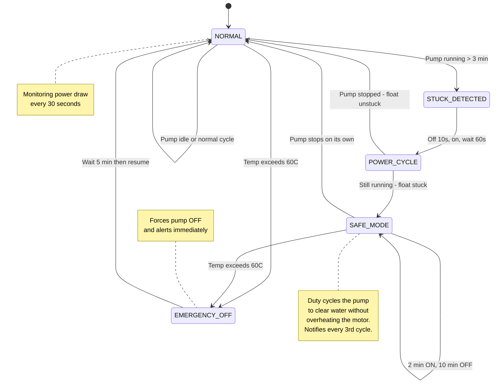
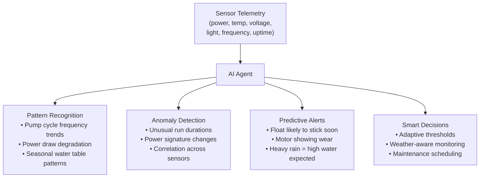

# Sump Pump Monitor

Smart monitoring system for a sump pump with a sticky float switch. Uses a [Shelly Plug US Gen4](https://www.shelly.com/en-us/products/shop/shelly-plug-us-gen-4) smart plug to detect problems, auto-recover, and alert you before your basement floods.

## The Problem

A sump pump's float switch can get stuck in the "on" position, causing the pump to run continuously. This leads to motor overheating, pump failure, and eventually a flooded basement.

```
                    NORMAL OPERATION                          STUCK FLOAT
                    ================                          ===========

              ┌─────────────────┐                       ┌─────────────────┐
              │    Sump Pit     │                       │    Sump Pit     │
              │                 │                       │                 │
              │  ┌───────────┐  │                       │  ┌───────────┐  │
              │  │   PUMP    │  │                       │  │   PUMP    │  │
              │  │   MOTOR   │  │                       │  │   MOTOR   │  │
              │  │  ┌─────┐  │  │                       │  │  ┌─────┐  │  │
              │  │  │/////│  │  │                       │  │  │/////│  │  │
              │  └──┤     ├──┘  │                       │  └──┤     ├──┘  │
              │     │     │     │                       │     │     │     │
              │  ┌──┴─────┴──┐  │                       │  ┌──┴─────┴──┐  │
  Discharge ──┤  │ Impeller  │  │           Discharge ──┤  │ Impeller  │  │
    Pipe      │  └───────────┘  │             Pipe      │  └───────────┘  │
              │                 │                       │                 │
              │     ○ Float     │  ← Drops when         │     ○ Float     │  ← STUCK UP!
              │     │ Switch    │    water recedes       │    /│ Switch    │    Won't drop
              │     │           │    (pump stops)        │   / │           │    (pump keeps
              │     │           │                       │  /  │           │     running!)
           ~~~│~~~~~│~~~~~~~~~~~│~~~                    │     │           │
           Water    │   Level   │                       │     │           │
              │     │           │                       │     │           │
              └─────┴───────────┘                       └─────┴───────────┘

         Float rises with water,                  Float jammed in up position,
         triggers pump ON.                        pump runs continuously.
         When water drops, float                  Motor overheats → pump dies
         drops → pump OFF.                        → basement floods.
```

## The Solution

A smart plug with power monitoring sits between the wall outlet and the pump. Software monitors the power draw to detect problems and takes automatic action.



## What the Smart Plug Measures

The Shelly Plug Gen4 provides real-time sensor data via a local HTTP API:

```
┌──────────────────────────────────────────────────────────────────┐
│                     SHELLY PLUG US GEN4                          │
│                                                                  │
│  ┌─────────────┐  ┌─────────────┐  ┌─────────────┐              │
│  │ POWER METER │  │ TEMPERATURE │  │   LIGHT     │              │
│  │             │  │   SENSOR    │  │   SENSOR    │              │
│  │ Watts   (W) │  │             │  │             │              │
│  │ Volts   (V) │  │ Plug temp   │  │ dark        │              │
│  │ Amps    (A) │  │ in °C / °F  │  │ dim         │              │
│  │ Freq   (Hz) │  │             │  │ bright      │              │
│  │ Energy(kWh) │  │             │  │             │              │
│  └─────────────┘  └─────────────┘  └─────────────┘              │
│                                                                  │
│  ┌─────────────┐  ┌─────────────┐                                │
│  │    WIFI     │  │   SYSTEM    │                                │
│  │             │  │             │                                │
│  │ RSSI  (dBm) │  │ Uptime (s)  │                                │
│  │ SSID        │  │ RAM / FS    │                                │
│  │ IP address  │  │ FW version  │                                │
│  └─────────────┘  └─────────────┘                                │
└──────────────────────────────────────────────────────────────────┘
```

## Monitoring State Machine

The monitor tracks pump power draw and progresses through states based on behavior:



## Alert Matrix

Every 30 seconds, the monitor checks all sensors and can trigger alerts:

```
┌───────────────────┬──────────────────────┬───────────────────────────────────────┐
│ WHAT WE MONITOR   │ ALERT TRIGGER        │ WHY IT MATTERS                       │
├───────────────────┼──────────────────────┼───────────────────────────────────────┤
│                   │                      │                                       │
│ Power draw        │ > 100W for > 3 min   │ Float stuck UP → motor overheats      │
│                   │                      │                                       │
│ Power draw        │ 0W for > 24 hours    │ Float stuck DOWN → won't pump         │
│                   │                      │ → basement floods silently            │
│                   │                      │                                       │
│ Running wattage   │ Outside 350-700W     │ Motor degrading, blockage, or         │
│                   │                      │ electrical fault                      │
│                   │                      │                                       │
│ Plug temperature  │ > 50°C early warning │ Trending hot, investigate soon        │
│                   │ > 60°C emergency OFF │ Prevent fire / melt damage            │
│                   │                      │                                       │
│ Grid voltage      │ < 110V (brownout)    │ Low voltage damages pump motor        │
│                   │ > 130V (overvoltage) │ High voltage fries electronics        │
│                   │                      │                                       │
│ Light level       │ Changes from "dark"  │ Someone in basement, or water         │
│                   │                      │ reflecting light (overflow?)          │
│                   │                      │                                       │
│ WiFi signal       │ RSSI < -80 dBm       │ About to lose plug connectivity       │
│                   │                      │                                       │
│ Plug uptime       │ Uptime decreases     │ Power outage → pump was offline       │
│                   │                      │                                       │
│ Switch output     │ OFF unexpectedly     │ Pump unprotected → auto-turns ON      │
│                   │                      │                                       │
└───────────────────┴──────────────────────┴───────────────────────────────────────┘
```

## Pump Power Profile

Calibrated readings from our specific pump:

```
Power (W)
  700 ┤
      │
  600 ┤
      │          ┌──────────────────────── Running: ~500-520W
  500 ┤──────────┤
      │          │
  400 ┤          │
      │          │     ← Alert if outside 350-700W range
  300 ┤          │
      │          │
  200 ┤          │
      │          │
  100 ┤──────────┤─ ─ ─ ─ ─ ─ ─ ─ ─ ─ ─ Detection threshold: 100W
      │  ~57W   │
   50 ┤  startup │
      │  spike   │
    0 ┤──────────┴──────────────────────── Idle: 0W
      └──────────┬──────────────────────
                 │
            Pump triggered
            by float switch
```

## Architecture

```
┌─────────────────────────────────────────────────────────────────────────────┐
│                              BASEMENT                                       │
│                                                                             │
│   ┌─────────┐     Power cord     ┌───────────────────┐     ┌────────────┐  │
│   │  Sump   │────────────────────│   Shelly Plug     │─────│   Wall     │  │
│   │  Pump   │    ~9A @ 120V      │   US Gen4         │     │  Outlet    │  │
│   │         │    (~1080W peak)    │                   │     │  120V/15A  │  │
│   │ float── │                    │ ● Power meter     │     └────────────┘  │
│   │ switch  │                    │ ● Temp sensor     │                      │
│   └─────────┘                    │ ● Light sensor    │                      │
│                                  │ ● WiFi (HTTP API) │                      │
│                                  └─────────┬─────────┘                      │
│                                            │                                │
└────────────────────────────────────────────┼────────────────────────────────┘
                                             │ WiFi (digest auth)
                                             │ Poll every 30s
                                             │
┌────────────────────────────────────────────┼────────────────────────────────┐
│                        HOME NETWORK         │                               │
│                                             │                               │
│   ┌─────────────────────────────────────────┼───────────────────────┐       │
│   │              LINUX SERVER               │                       │       │
│   │                                         ▼                       │       │
│   │   ┌───────────────────┐    ┌───────────────────────┐           │       │
│   │   │  sump-pump-       │    │  sump-pump-           │           │       │
│   │   │  monitor.service  │    │  dashboard.service    │           │       │
│   │   │                   │    │                       │           │       │
│   │   │  State machine    │    │  Flask web UI (:8077) │           │       │
│   │   │  Auto power cycle │    │  Status + Controls    │           │       │
│   │   │  Alert engine     │    │  Live logs            │           │       │
│   │   └────────┬──────────┘    └───────────┬───────────┘           │       │
│   │            │                           │                       │       │
│   └────────────┼───────────────────────────┼───────────────────────┘       │
│                │                           │                               │
│                │              ┌─────────────────────────┐                  │
│                │              │  Phone / Laptop         │                  │
│                │              │  http://server:8077     │                  │
│                │              │  or pump.py CLI         │                  │
│                │              └─────────────────────────┘                  │
│                │                                                           │
└────────────────┼───────────────────────────────────────────────────────────┘
                 │
                 │ Alerts
                 ├──────────────────────┐
                 ▼                      ▼
        ┌──────────────┐      ┌──────────────┐
        │  Gmail SMTP  │      │   ntfy.sh    │
        │  (email)     │      │   (push)     │
        └──────────────┘      └──────────────┘
```

## Project Structure

```
home-assistant/
├── sump_pump_monitor.py   # Main monitoring service (systemd)
├── dashboard.py           # Web dashboard + REST API (Flask, port 8077)
├── pump.py                # CLI tool for manual control
├── sump_pump_timer.py     # Retired Tuya timer (reference only)
├── .env                   # Credentials and config (not in git)
├── .env.example           # Template showing required config
├── .gitignore             # Excludes .env, logs, notes
└── README.md              # This file
```

## Setup

### 1. Shelly Plug

1. Connect the Shelly Plug US Gen4 to your WiFi via the Shelly app
2. Enable digest authentication:
   ```python
   import requests, hashlib
   user, password = 'admin', 'YOUR_PASSWORD'
   realm = 'shellyplugusg4-XXXXXXXXXXXX'  # from device info
   ha1 = hashlib.sha256(f'{user}:{realm}:{password}'.encode()).hexdigest()
   requests.post('http://SHELLY_IP/rpc', json={
       'id': 1, 'method': 'Shelly.SetAuth',
       'params': {'user': user, 'realm': realm, 'ha1': ha1}
   })
   ```
3. Disable cloud connection (local control only)

### 2. Server

```bash
# Clone and configure
git clone <repo-url> ~/home-assistant
cd ~/home-assistant
cp .env.example .env
chmod 600 .env
# Edit .env with your credentials

# Create Python venv
python3 -m venv venv
source venv/bin/activate
pip install flask requests

# Test
python3 pump.py status
```

### 3. Systemd Services

**Monitor** (`/etc/systemd/system/sump-pump-monitor.service`):
```ini
[Unit]
Description=Sump Pump Monitor
After=network-online.target
Wants=network-online.target

[Service]
Type=simple
User=your_user
WorkingDirectory=/home/your_user/home-assistant
ExecStart=/home/your_user/home-assistant/venv/bin/python3 sump_pump_monitor.py
Restart=always
RestartSec=10
StandardOutput=append:/home/your_user/home-assistant/sump_pump_monitor.log
StandardError=append:/home/your_user/home-assistant/sump_pump_monitor.log

[Install]
WantedBy=multi-user.target
```

**Dashboard** (`/etc/systemd/system/sump-pump-dashboard.service`):
```ini
[Unit]
Description=Sump Pump Dashboard
After=network-online.target
Wants=network-online.target

[Service]
Type=simple
User=your_user
WorkingDirectory=/home/your_user/home-assistant
ExecStart=/home/your_user/home-assistant/venv/bin/python3 dashboard.py
Restart=always
RestartSec=10

[Install]
WantedBy=multi-user.target
```

```bash
sudo systemctl daemon-reload
sudo systemctl enable --now sump-pump-monitor
sudo systemctl enable --now sump-pump-dashboard
```

### 4. Notifications

- **Email**: Create a [Gmail app password](https://myaccount.google.com/apppasswords) and add to `.env`
- **Push**: Install [ntfy app](https://ntfy.sh) on your phone, subscribe to your topic name

## CLI Usage

```bash
./pump.py status      # Show power, temp, voltage, light, WiFi
./pump.py on          # Turn pump on
./pump.py off         # Turn pump off
./pump.py cycle       # Power cycle (off 10s, on)
./pump.py watch       # Live monitoring table (Ctrl+C to stop)
```

## Dashboard

Mobile-friendly dark-themed web UI at `http://your-server:8077`

- Live pump status (idle / running / off / error)
- Real-time power, current, voltage (with frequency), temperature, light level
- Color-coded health badges for voltage, temperature, WiFi signal
- Plug uptime tracking (detects reboots / power outages)
- Turn on / off / power cycle controls
- Recent monitor logs
- Auto-refreshes every 15 seconds

## Future: AI Monitoring

The system is designed to feed into an AI agent that will:



The current rule-based system handles the critical safety logic. The AI layer will add intelligence on top — learning what "normal" looks like for this specific pump and environment, and catching subtle patterns that fixed thresholds miss.

## Lessons Learned

- **Energy monitoring is essential.** Without it, a smart plug is just a remote on/off switch. You can't detect if the pump is actually running.
- **3 minutes is the right threshold** for a sump pump. Normal cycle is 1-2 min; 3 min means something is wrong.
- **Safe mode (duty cycle) is critical.** You can't just shut off a sump pump when the float is stuck — water still needs to be pumped. 2 min on / 10 min off balances flood prevention with motor protection.
- **Power cycle first, then alert.** Many stuck floats resolve with a simple off/on cycle. No need to wake someone up at 3 AM if the problem fixes itself.
- **Temperature monitoring is a free safety net.** The smart plug already has the sensor — use it.
- **US carriers block unregistered SMS.** Don't waste time with email-to-SMS gateways or unregistered Twilio numbers. Push notifications (ntfy.sh) are free, instant, and reliable.
- **Local API > cloud dependency.** Your sump pump monitor should work even if the internet is down.

## License

MIT
